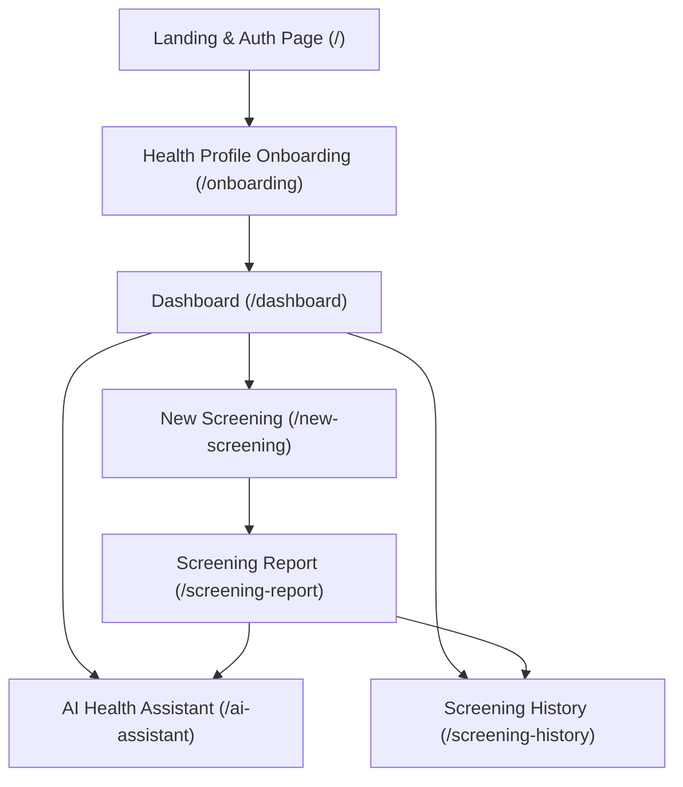

# **HEMOLENS — PRODUCT & TECHNICAL SPECIFICATION (MASTER REFERENCE)**

> **Project Vision:** Non-invasive, AI-powered preliminary anemia screening using lower eyelid (conjunctiva) and optional nail-bed images, combined with user health profiling and a context-aware AI health assistant.
>
> **Important Disclaimer:** *HemoLens is a preliminary wellness screening tool designed to encourage timely clinical blood testing. It is NOT intended to diagnose anemia or replace professional medical consultations.*

---

## **1. Executive Summary & Goals**

- **Problem:** Millions remain unaware of anemia due to mild early symptoms (fatigue, dizziness) and barriers to routine blood testing.
- **Solution:** A responsive web application where users take a smartphone camera picture of their lower eyelid, enter basic health context, receive an instant estimated Hemoglobin (Hb) range and risk assessment, and chat with an AI Health Assistant for personalized wellness guidance.
- **Core Value Proposition:**
  - Fast, accessible screening (< 3 minutes).
  - Zero out-of-pocket hardware/deployment costs (open-source & free-tier stack).
  - Contextual AI explanations with clinical and dietary suggestions.
  - Clear medical disclaimers and timely recommendations for confirmatory lab tests.

---

## **2. Architecture & Tech Stack**

### **Active Frontend (Phase 1 — Implemented)**
- **Framework:** Next.js 16.3.5 (App Router, Server & Client Components)
- **UI & Language:** React 19.2.8, TypeScript 5, Tailwind CSS v4 (`@tailwindcss/postcss`)
- **Icons & Animation:** Lucide React (`lucide-react`), Framer Motion (`framer-motion`)
- **Styling System:** CSS variables & design tokens defined in `app/globals.css`:
  - Primary Theme: Crimson Red (`#bf191d`, `#9a1417`, `#e8363a`)
  - Accent Tones: Teal/Cyan (`#0d9488`, `#c5feff`)
  - Typography: Inter font family (`--font-sans`)
  - Surface & Slate: `#f8fafc` background, `#0f172a` headings, `#64748b` muted text.

### **Backend & AI Services (Phase 2 — Target Stack)**
- **API Framework:** FastAPI (Python 3.10+)
- **Computer Vision:** OpenCV (`cv2`), NumPy (palpebral conjunctiva ROI extraction, color space normalization, erythema index calculation)
- **Machine Learning:** Scikit-learn / XGBoost / Random Forest (trained on public conjunctiva datasets like CP-AnemiC / Eyes Defy Anemia)
- **AI Health Assistant:** Local LLM via Ollama (Qwen 2.5 / Gemma 2 / Llama 3) with LangChain and memory persistence
- **Database & Auth:** Supabase PostgreSQL & Supabase Auth (or lightweight SQLite/PostgreSQL for local demo)
- **Deployment:** Vercel (Frontend), Render / Railway Free Tier (FastAPI Backend)

---

## **3. Current Implementation Status (Built Pages & User Flow)**

The complete frontend interface and interactive client state transitions are built:

### **1. Landing & Authentication (`/app/page.tsx`)**
- Value proposition header with gradient branding.
- 4-step interactive screening flow overview:
  1. *Quick Eye Capture* (Lower eyelid photo)
  2. *Smart Image Check* (Blur/lighting verification)
  3. *AI Health Analysis* (Multimodal risk model)
  4. *Actionable Guidance* (Personalized next steps & diet advice)
- Feature highlight grid (Computer Vision, Instant Hb Risk, Clinical Safety).
- Tabbed Authentication card (Sign In / Register form with validation).

### **2. Health Profile Onboarding (`/app/onboarding/page.tsx`)**
- Multi-card profile builder collecting clinical variables:
  - **Basic Info:** Age, Gender, Height (cm), Weight (kg).
  - **Diet & History:** Dietary pattern (Vegetarian, Non-veg, Vegan), Anemia history, Existing chronic conditions.
  - **Symptoms Selector:** Multi-select chips (Fatigue, Dizziness, Weakness, Pale skin, Shortness of breath, Cold hands/feet, None) with custom input.
  - **Physiological Factors:** Pregnancy status (First/Second/Third trimester, Postpartum, Not applicable).
  - **Location:** Geographic/regional context.
- Animated success toast and routing to `/dashboard`.

### **3. Dashboard (`/app/dashboard/page.tsx`)**
- Responsive persistent navigation with mobile drawer and desktop sidebar.
- **Hero Screening Banner:** Quick CTA to launch a new eyelid scan.
- **Quick Action Cards:** Direct links to Screening History and AI Health Assistant.
- **Latest Screening Metrics:** At-a-glance Hb range (`10.2–11.0 g/dL`), risk category (`Moderate Risk`), confidence score (`87%`), and contributing factors.
- Regulatory safeguard footer.

### **4. Guided Camera & Image Capture (`/app/new-screening/page.tsx`)**
- **Step 1 — Lower Eyelid Image (Mandatory):** Eyelid capture/upload card with framing guides, lighting tips, preview card, and retake controls.
- **Step 2 — Nail-bed Image (Optional):** Secondary optical biomarker card for supplementary capillary refill/pallor analysis.
- **Step 3 — Active Symptoms Check:** Real-time symptom multi-select for the current screening session.
- **Screening Bottom Bar:** Progress validation and instant analysis trigger.

### **5. Personalized Screening Report (`/app/screening-report/page.tsx`)**
- **Report Header:** User name, screening date, report ID, Print/Export CTA, and Share actions.
- **Top Metrics Grid:** Estimated Hb level badge, Risk Severity level (Normal, Mild, Moderate, Severe), and AI Model Confidence gauge.
- **Clinical Insights:** Explanation of results, contributing lifestyle/symptom factors, and recommended dietary/lifestyle next steps.
- **Trends & Healthcare Access:** Hb historical progression chart, and nearby diagnostic lab / primary care lookup module.
- **Clinical Safeguard Disclaimer:** Mandatory medical guidance notification.

### **6. AI Health Assistant (`/app/ai-assistant/page.tsx`)**
- **Chat Context Banner:** Persistent summary showing user's latest Hb estimate and risk level.
- **Multi-Turn Chat Interface:** Timestamped chat history, typing indicators, structured bulleted tips, and clinical disclaimers on advice.
- **Suggested Prompts Grid:** One-click quick questions (*"Why am I feeling dizzy?"*, *"What iron-rich foods should I eat?"*, *"When should I consult a doctor?"*, *"How does eyelid screening work?"*).
- **Interactive Chat Input:** Dynamic contextual responses tailored to user history.

### **7. Screening History (`/app/screening-history/page.tsx`)**
- **Historical Records List:** Chronological timeline of previous screenings with date, status, Hb range, and AI summary notes.
- **Trend Analytics & Care Options:** Visual trajectory of hemoglobin fluctuations over time and actionable clinical advice.

---

## **4. Functional Requirements Summary**

| ID | Requirement | Status | Details |
|---|---|---|---|
| **FR-01** | User Authentication | UI Built | Sign up, login, session persistence. Backend Supabase integration in Phase 2. |
| **FR-02** | Health Profile Onboarding | UI Built | Stores demographics, diet, symptoms, pregnancy, and medical conditions. |
| **FR-03** | Guided Camera Capture | UI Built | Dual-capture support: lower eyelid (primary) and nail bed (optional). |
| **FR-04** | Image Quality Validation | Phase 2 | Automatic validation for blur, brightness, resolution, and eye framing. |
| **FR-05** | Computer Vision Preprocessing | Phase 2 | OpenCV palpebral conjunctiva segmentation, color normalization (RGB/HSV/LAB), and feature extraction. |
| **FR-06** | ML Risk & Hb Estimation | Phase 2 | ML model predicting Hb range and risk classification (Normal, Mild, Moderate, Severe). |
| **FR-07** | Screening Report Generation | UI Built | Full report layout with metrics, contributing factors, recommendations, and disclaimer. |
| **FR-08** | Context-Aware AI Chatbot | UI Built | Conversational assistant with memory of user health profile and past screenings. |
| **FR-09** | Screening History & Trends | UI Built | Historical archive of all screenings with metric comparison and trajectory graphs. |

---

## **5. Scope & Non-Goals**

### **In-Scope (Hackathon MVP)**
- End-to-end web application with complete screening workflow.
- OpenCV image preprocessing and validation pipeline.
- Machine Learning inference on conjunctiva images + health context.
- Local LLM AI Assistant (Ollama / Qwen / Gemma) for health education.
- Responsive mobile-first interface adhering to established design system.

### **Out-of-Scope (Non-Goals)**
- Definitive clinical diagnosis or prescription writing.
- Hospital EMR / Electronic Health Record integration.
- Direct lab API integration (lookup module provides educational guidance only).
- Native iOS/Android apps (PWA / mobile web is used).
- Offline client-side neural network execution.

---

## **6. Next Phase Roadmap (Phase 2 — Backend & ML Integration)**

### **Step 1: FastAPI Backend Setup**
- Create `backend/` directory with FastAPI application.
- Setup CORS, Pydantic schemas, and endpoints:
  - `POST /api/screen/validate-image`: Image sharpness and brightness check.
  - `POST /api/screen/analyze`: OpenCV feature extraction + ML inference.
  - `POST /api/chat`: Ollama LLM endpoint with conversation context.
  - `GET/POST /api/profile` & `/api/history`: Supabase database sync.

### **Step 2: Computer Vision Pipeline**
- Implement eyelid conjunctiva detection and ROI extraction using OpenCV.
- Extract red cell index, erythema index, and color channel statistics.

### **Step 3: Machine Learning Model**
- Train Random Forest / XGBoost model using public datasets (CP-AnemiC / Eyes Defy Anemia).
- Output: Hb range estimation, Anemia risk classification, and Confidence score.

### **Step 4: AI Assistant LLM Service**
- Connect FastAPI to Ollama running Qwen 2.5 / Gemma 2.
- Inject system prompt with clinical guardrails, user profile, and recent screening results.

### **Step 5: End-to-End Testing & Verification**
- Connect Next.js frontend API calls to FastAPI endpoints.
- Validate full flow from camera capture to real ML prediction and AI chat.
