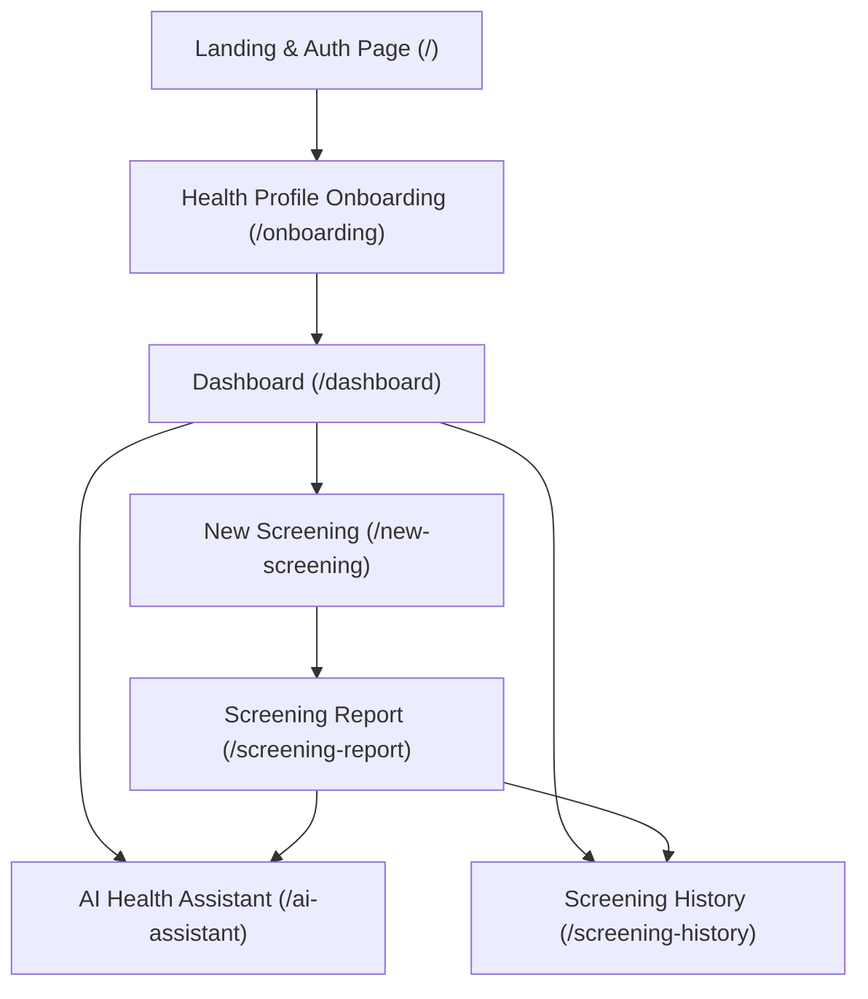

# **HEMOLENS — PRODUCT & TECHNICAL SPECIFICATION (MASTER REFERENCE)**

> **Project Vision:** Non-invasive, AI-powered preliminary anemia screening using lower eyelid (conjunctiva) and optional nail-bed images, combined with user health profiling and a context-aware AI health assistant.
>
> **Important Disclaimer:** *HemoLens is a preliminary wellness screening tool designed to encourage timely clinical blood testing. It is NOT intended to diagnose anemia or replace professional medical consultations.*

---

## **1. Executive Summary & Goals**

- **Problem:** Millions remain unaware of anemia due to mild early symptoms (fatigue, dizziness) and barriers to routine blood testing.
- **Solution:** A responsive web application where users take a smartphone camera picture of their lower eyelid, enter basic health context, receive an instant estimated Hemoglobin (Hb) range and risk assessment, and chat with an AI Health Assistant for personalized wellness guidance.
- **Core Value Proposition:**
  - Fast, accessible screening (< 3 minutes).
  - Zero out-of-pocket hardware/deployment costs (open-source & free-tier stack).
  - Contextual AI explanations with clinical and dietary suggestions.
  - Clear medical disclaimers and timely recommendations for confirmatory lab tests.

---

## **2. Architecture & Tech Stack**

### **Active Frontend (Phase 1 — Implemented)**
- **Framework:** Next.js 16.3.5 (App Router, Server & Client Components)
- **UI & Language:** React 19.2.8, TypeScript 5, Tailwind CSS v4 (`@tailwindcss/postcss`)
- **Icons & Animation:** Lucide React (`lucide-react`), Framer Motion (`framer-motion`)
- **Styling System:** CSS variables & design tokens defined in `app/globals.css`:
  - Primary Theme: Crimson Red (`#bf191d`, `#9a1417`, `#e8363a`)
  - Accent Tones: Teal/Cyan (`#0d9488`, `#c5feff`)
  - Typography: Inter font family (`--font-sans`)
  - Surface & Slate: `#f8fafc` background, `#0f172a` headings, `#64748b` muted text.

### **Backend & AI Services (Phase 2 — Target Stack)**
- **API Framework:** FastAPI (Python 3.10+)
- **Computer Vision:** OpenCV (`cv2`), NumPy — palpebral conjunctiva ROI extraction, LAB/CLAHE color normalization, nail-bed color-ratio feature extraction.
- **Machine Learning:**
  - **Eyelid (primary):** EfficientNet-B0 (ImageNet-pretrained transfer learning) with a dual-task head — anemia classification (sigmoid, BCE loss) + continuous Hb regression (MSE loss). Fine-tuned on **CP-AnemiC** and **Eyes-Defy-Anemia** public datasets, seeded from the existing Hugging Face `galihkjaya/anemia-palor-detection` checkpoint as baseline.
  - **Nail-bed (optional/secondary):** Random Forest / XGBoost on RGB/HSV/LAB color-ratio features — not a deep-learning model, kept lightweight and returns `null` if no usable data/model is available.
- **AI Health Assistant:** Local LLM via Ollama (Qwen 2.5 / Gemma 2 / Llama 3) with LangChain and memory persistence
- **Database & Auth:** Supabase PostgreSQL & Supabase Auth (or lightweight SQLite/PostgreSQL for local demo)
- **Deployment:** Vercel (Frontend), Render / Railway Free Tier (FastAPI Backend)

---

## **3. Current Implementation Status (Built Pages & User Flow)**

The complete frontend interface and interactive client state transitions are built:



### **1. Landing & Authentication (`/app/page.tsx`)**
- Value proposition header with gradient branding.
- 4-step interactive screening flow overview:
  1. *Quick Eye Capture* (Lower eyelid photo)
  2. *Smart Image Check* (Blur/lighting verification)
  3. *AI Health Analysis* (Multimodal risk model)
  4. *Actionable Guidance* (Personalized next steps & diet advice)
- Feature highlight grid (Computer Vision, Instant Hb Risk, Clinical Safety).
- Tabbed Authentication card (Sign In / Register form with validation).

### **2. Health Profile Onboarding (`/app/onboarding/page.tsx`)**
- Multi-card profile builder collecting clinical variables:
  - **Basic Info:** Age, Gender, Height (cm), Weight (kg).
  - **Diet & History:** Dietary pattern (Vegetarian, Non-veg, Vegan), Anemia history, Existing chronic conditions.
  - **Symptoms Selector:** Multi-select chips (Fatigue, Dizziness, Weakness, Pale skin, Shortness of breath, Cold hands/feet, None) with custom input.
  - **Physiological Factors:** Pregnancy status (First/Second/Third trimester, Postpartum, Not applicable).
  - **Location:** Geographic/regional context.
- Animated success toast and routing to `/dashboard`.

### **3. Dashboard (`/app/dashboard/page.tsx`)**
- Responsive persistent navigation with mobile drawer and desktop sidebar.
- **Hero Screening Banner:** Quick CTA to launch a new eyelid scan.
- **Quick Action Cards:** Direct links to Screening History and AI Health Assistant.
- **Latest Screening Metrics:** At-a-glance Hb range (`10.2–11.0 g/dL`), risk category (`Moderate Risk`), confidence score (`87%`), and contributing factors.
- Regulatory safeguard footer.

### **4. Guided Camera & Image Capture (`/app/new-screening/page.tsx`)**
- **Step 1 — Lower Eyelid Image (Mandatory):** Eyelid capture/upload card with framing guides, lighting tips, preview card, and retake controls.
- **Step 2 — Nail-bed Image (Optional):** Secondary optical biomarker card for supplementary capillary refill/pallor analysis.
- **Step 3 — Active Symptoms Check:** Real-time symptom multi-select for the current screening session.
- **Screening Bottom Bar:** Progress validation and instant analysis trigger.

### **5. Personalized Screening Report (`/app/screening-report/page.tsx`)**
- **Report Header:** User name, screening date, report ID, Print/Export CTA, and Share actions.
- **Top Metrics Grid:** Estimated Hb level badge, Risk Severity level (Normal, Mild, Moderate, Severe), and AI Model Confidence gauge.
- **Clinical Insights:** Explanation of results, contributing lifestyle/symptom factors, and recommended dietary/lifestyle next steps.
- **Trends & Healthcare Access:** Hb historical progression chart, and nearby diagnostic lab / primary care lookup module.
- **Clinical Safeguard Disclaimer:** Mandatory medical guidance notification.

### **6. AI Health Assistant (`/app/ai-assistant/page.tsx`)**
- **Chat Context Banner:** Persistent summary showing user's latest Hb estimate and risk level.
- **Multi-Turn Chat Interface:** Timestamped chat history, typing indicators, structured bulleted tips, and clinical disclaimers on advice.
- **Suggested Prompts Grid:** One-click quick questions (*"Why am I feeling dizzy?"*, *"What iron-rich foods should I eat?"*, *"When should I consult a doctor?"*, *"How does eyelid screening work?"*).
- **Interactive Chat Input:** Dynamic contextual responses tailored to user history.

### **7. Screening History (`/app/screening-history/page.tsx`)**
- **Historical Records List:** Chronological timeline of previous screenings with date, status, Hb range, and AI summary notes.
- **Trend Analytics & Care Options:** Visual trajectory of hemoglobin fluctuations over time and actionable clinical advice.

---

## **4. Functional Requirements Summary**

| ID | Requirement | Status | Details |
|---|---|---|---|
| **FR-01** | User Authentication | UI Built | Sign up, login, session persistence. Backend Supabase integration in Phase 2. |
| **FR-02** | Health Profile Onboarding | UI Built | Stores demographics, diet, symptoms, pregnancy, and medical conditions. |
| **FR-03** | Guided Camera Capture | UI Built | Dual-capture support: lower eyelid (primary) and nail bed (optional). |
| **FR-04** | Image Quality Validation | Implemented | Deterministic OpenCV & MediaPipe checks:<br>• **Eyelid (`POST /api/screen/validate-image-eyelid`):** resolution (≥400×300), normalized blur (Laplacian variance ≥25.0 on 1024px scale), brightness window (30–235), eye framing, and palpebral conjunctiva visibility/eversion.<br>• **Nail-bed (`POST /api/screen/validate-image-nail`):** resolution (≥400×300), skin-edge sharpness (Tenengrad ≥350.0), brightness window (30–235), and multi-cue fingernail detection requiring ≥ 3 clearly visible, non-zoomed-out fingernails.<br>Immediate validation on image upload/capture with interactive quality feedback. |
| **FR-05** | Computer Vision Preprocessing | Implemented | OpenCV palpebral conjunctiva ROI extraction, LAB + CLAHE color normalization, 49-dimensional color/texture feature extraction (`eyelid_49_v1`). |
| **FR-06** | ML Risk & Hb Estimation | Implemented | Production `ExtraTreesRegressor` inference singleton (`eyelid_hb_model_v1.joblib`) outputs continuous Hb estimate + calibrated uncertainty interval + deterministic WHO 2024 clinical risk classification. |
| **FR-07** | Screening Report Generation | UI Built | Full report layout with metrics, contributing factors, recommendations, and disclaimer; text generated via a single LLM call from structured ML output + profile + symptoms. |
| **FR-08** | Context-Aware AI Chatbot | UI Built | Conversational assistant with memory of user health profile and past screenings; one LLM call per message. |
| **FR-09** | Screening History & Trends | UI Built | Historical archive of all screenings with metric comparison and trajectory graphs. |

---

## **5. Scope & Non-Goals**

### **In-Scope (Hackathon MVP)**
- End-to-end web application with complete screening workflow.
- OpenCV image preprocessing and validation pipeline (`POST /api/screen/validate-image-eyelid` & `POST /api/screen/validate-image-nail` implemented & calibrated).
- Machine Learning inference on conjunctiva images + health context.
- Local LLM AI Assistant (Ollama / Qwen / Gemma) for health education.
- Responsive mobile-first interface adhering to established design system.

### **Out-of-Scope (Non-Goals)**
- Definitive clinical diagnosis or prescription writing.
- Hospital EMR / Electronic Health Record integration.
- Direct lab API integration (lookup module provides educational guidance only).
- Native iOS/Android apps (PWA / mobile web is used).
- Offline client-side neural network execution.
- Training deep-learning models from scratch (ViT, U-Net, custom CNN, GANs, joint multimodal networks) — out of scope given the 4-day/₹0 constraint; transfer learning + classical ML only.

---

## **6. AI/ML Pipeline (Finalized Architecture)**

> Full stage-by-stage detail, API contracts, and dataset/metric specifics live in **`pipeline.md`**. Summary below.

- **Strict separation:** CV/ML produces all numeric predictions; the LLM is used only for explanation (report + chat), never for computing Hb or risk. **0 LLM calls** in the inference path, **1 LLM call** for report generation, **1 LLM call per chatbot message**.
- **Two-stage CV + ML design**, eyelid model as primary/quantitative, nail-bed model as optional/secondary:

```
IMAGE(S) → OpenCV & MediaPipe Validate (blur/brightness/resolution/eyelid exposure) [IMPLEMENTED]
        → ROI Extraction (conjunctiva / nail)
        → Color Normalization (LAB + CLAHE / RGB-HSV-LAB features)
        → ML Model (EfficientNet-B0 dual-head | RF/XGBoost)
        → {hb_estimate, anemia_probability, confidence}
        → Confidence-weighted Fusion → Hb Range + Risk Tier + Overall Confidence
        → + Onboarding Profile + Active Symptoms → Structured Patient State (JSON)
        → 1 LLM call (local Ollama) → Human-readable Screening Report
        → Supabase (save compact summary) → AI Assistant (context-aware chat)
```

- **Symptoms/profile isolation:** subjective and contextual data (age, sex, pregnancy, symptoms, history) are merged only at the report-generation layer, never fed into the image model itself — preserving interpretability of image-derived evidence.
- **Uncertainty over point estimates:** models output a continuous Hb value plus an uncertainty/confidence measure; the application layer derives the displayed range (e.g., predicted ± uncertainty) and maps it to a risk tier rather than hard-coding one universal threshold.
- **Datasets:** CP-AnemiC (710 conjunctival images, pediatric) + Eyes-Defy-Anemia (218 images, Hb + segmentation masks) for eyelid fine-tuning, seeded from the existing Hugging Face `galihkjaya/anemia-palor-detection` EfficientNet-B0 baseline. Nail-bed relies on classical color-feature engineering (RF/XGBoost), not a public deep-learning dataset.
- **Splitting/evaluation:** patient-wise train/val/test splits (never image-wise); classification metrics (accuracy, precision, recall, specificity, F1, ROC-AUC) and regression metrics (MAE, RMSE, R², Pearson r, Bland–Altman) reported separately.

---

## **7. Next Phase Roadmap (Phase 2 — Backend & ML Integration)**

### **Step 1: FastAPI Backend Setup (Implemented & Calibrated)**
- Created `backend/` directory with FastAPI application (`backend/main.py`, `backend/routers/screen.py`, `backend/routers/features.py`, `backend/routers/analyze.py`, `backend/config.py`).
- Setup CORS, Pydantic schemas, and endpoints:
  - `POST /api/screen/validate-image-eyelid` *(Implemented & Calibrated)*: Pre-upload quality check validating resolution, standardized blur, exposure, and palpebral conjunctiva presence.
  - `POST /api/screen/validate-image-nail` *(Implemented & Calibrated)*: Pre-upload quality check for fingernail visibility and sharpness.
  - `POST /api/screen/extract-eyelid-features` *(Implemented)*: Isolated 49-dim feature extraction and ROI markup.
  - `POST /api/screen/analyze` *(Implemented & Verified)*: Full unified pipeline: quality validation → conjunctiva ROI detection → 49-dim feature extraction → ML Hb regression → deterministic WHO 2024 clinical risk classification.
  - `POST /api/chat`: AI assistant endpoint with conversation context.

### **Step 2: Computer Vision Pipeline (Implemented)**
- Implemented eyelid conjunctiva detection and ROI extraction using OpenCV + MediaPipe fallback.
- Implemented 49-dimensional color/texture feature extraction (RGB/HSV/LAB statistics, ratios, excess red, luminance entropy).
- Implemented nail-bed multi-cue segmentation and quality validation.

### **Step 3: Machine Learning & Clinical Classification (Implemented)**
- Production inference service (`backend/ml/predictor.py`) wrapping `eyelid_hb_model_v1.joblib` (`ExtraTreesRegressor`) loaded as a thread-safe singleton.
- Strict Pydantic feature vector validation (`EyelidFeatureVectorInput`) enforcing exact 49-feature schema, ordering, and finite value bounds.
- Deterministic WHO 2024 anaemia risk classification layer (`backend/clinical/risk_classifier.py`) resolving demographic population groups (children 6–59m, 5–11y, 12–14y; non-pregnant women; pregnant women; men).

### **Step 4: AI Assistant & Report Generation (Next Step)**
- Connect Gemini / LLM layer to convert deterministic `ScreeningAnalysisResponse` + profile context into human-readable clinical reports.
- Clinical guardrail: LLM explains and summarizes, never modifies numerical Hb thresholds.